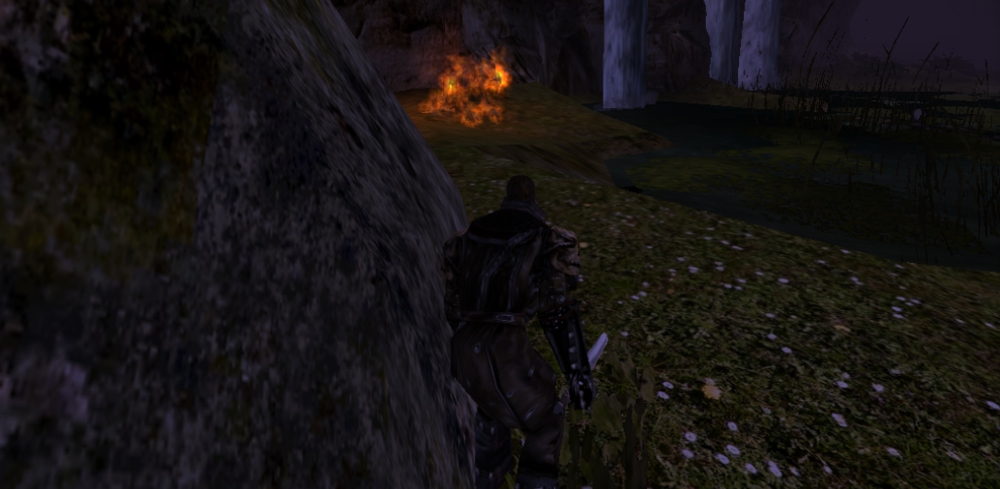
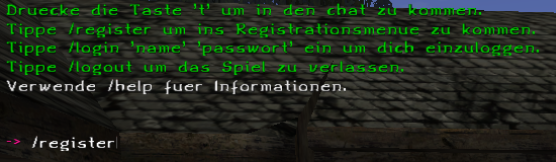
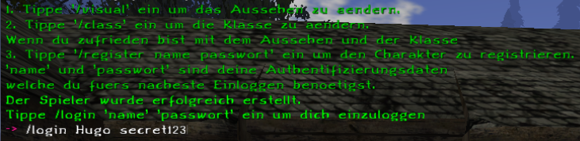
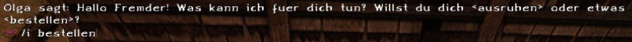
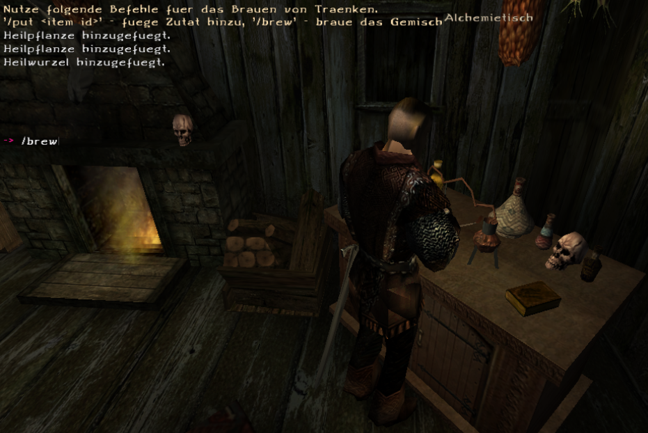

# gothic-multiplayer-adventures-server - Anleitung
Dieses Tutorial soll neuen Spielern die wichtigsten Features des Spiels beibringen. 

## Download
Ihr könnt Gothic-Multiplayer-Adventures bei Spine downloaden. Dafür müsst ihr Spine downloaden, dort einen Account anlegen und dann Gothic-Multiplayer-Adventures downloaden. Öffnet Gothic-Multiplayer-Adventures und eine Serverliste müsste sich dann öffnen. Der Gothic-Multiplayer-Adventures Server sollte vorselektiert sein, falls nicht dann ist dies die aktuelle 
 
 IP-Adresse:
 IP: 5.181.49.174
 Port: 28654

## Registrierung
Sobald ihr euch euch mit dem Server verbunden habt, könnt ihr euch Einloggen oder einen Account anlegen.

### Account anlegen.
* Drückt die Taste 'T' um die Chateingabe zu aktivieren.
* Tippt das Kommando **/register** ein um in den Registrierungs-Modus zu kommen.

 

 

* Tippt das Kommando **_/visual_** ein um das Aussehen eures Charakters zu setzen. Jetzt öffnet sich eine Benutzeroberfläche von wo aus ihr eure Kopf- und Körpermodelle und Texturen einstellen könnt.

 

 

* Tippt das Kommando **/class** ein um eure Klasse auszuwählen. Genauere Eigenschaften bezüglich der Klassen findet ihr im Kapitel zu den Klassen.
* Wenn ihr zufrieden seit, wird es Zeit euren Account zu konkret anzulegen. Tippt **/register 'name' 'passwort'** (ohne Anführungszeichen) ein um euren Account anzulegen. 'name' ist euer Accountname und gleichzeitig der Name eures Charakters. 'passwort' ist das Passwort eures Accounts.

 

 

### Einloggen
Sobald ihr einen Account angelegt habt, könnt ihr euch einloggen.
* Tippt das Kommando **/login 'name' 'passwort'** ein um euch unter euren Account einzuloggen.

 
 

## Klassen

In GMA existieren 5 Klassen. Diese sind 'Max-Leveled' und werden im Laufe des Spiels nicht stärker. Jede Klasse hat ihre Stärken und Schwächen und übernimmt eine spezifische Rolle.

### Fighter:
Der Fighter ist der zuverlässigste Nahkämpfer im Spiel. Er hat eine gute Stärke, viele Lebenspunkte und Meisterschaft im Einhandkampf. Wenn ihr gerne PVP macht, dann werdet ihr mit dieser Klasse vermutlich am meisten Erfolg haben.

 

 

### Hunter:
Der Hunter ist ein starker Fernkämpfer. Diese Klasse funktioniert am Besten wenn ihr auf Distanz bleibt. Zwar kann der Hunter auch ein wenig Nahkampf. Doch seine geringe Stärke und Lebenspunkte erlauben es ihm nicht gut mit den anderen Nahkampfklassen mitzuhalten.

 

 

### Spellcaster:
Der Spellcaster ist der klassiche Magier. Er verwendet arcane Magie um immensen Schaden zu verursachen. Leider verfügt der Spellcaster über die geringsten Lebenspunkte aller Klassen und muss auf jeden Fall auf Distanz bleiben. Des weiteren kann der Spellcaster andere Mitspieler heilen und ist deshalb essenziell für Teamplays.

 

 

### Berserker:
Der Berserker eignet sich für Spieler die sich gerne aufs Glück verlassen. Er ist die Klasse mit dem höchsten Schadenspotenzial. Leider hat er nur eine 30%ige Chance um einen Volltreffer zu landen. Deshalb ist er nicht die zuverlässigste Schadensquelle.

 

 

### Tank:
Der Tank ist eine wichtige Teamplayerklasse. Sein Schaden ist nur gering, aber er ist die Klasse mit den meisten Lebenspunkten. Des weiteren besitzt er praktische Zauberrunen um seine Teams zu unterstützen.

 

 
 

## Interagieren mit NPC's

In GMA könnt ihr mit verschiedenen NPC's interagieren. Die Interaktion erfolgt dabei über Kommandos. Um mit einem NPC zu interagieren fokussiert den NPC und tippt das Kommando **/i** ein.

 

 

Je nach NPC erscheint ein Dialog im Chat. Manchmal findet ihr dabei 2 Arten von speziellen Teilsätzen.

* Eckige Klammern: Manchmal findet ihr Teilsätze in \<eckigen Klammern\>. Wörter in eckigen Klammern sind Schlüsselwörter, womit ihr den Dialog weiterführen könnt. Tippt das Kommando **/i 'Teilsatz'** (Ohne Anführungzeichen) ein um den Dialog fortzuführen.

 

 

* In Anführungszeichen: Teilsätze in 'Anführungszeichen' sind Welt-Schlüsselwörter. Wörter in Anführungszeichen sind Schlüsselwörter die auf andere NPC's angewendet werden können.
Während eckige Klammern nur einen Dialog beim selben NPC auslösen, so könnt ihr versuchen Wörter in Anführungszeichen bei anderen NPC's zu feuern und schauen ob eine besondere Reaktion kommt. Tippt dafür das Kommando **/i 'Teilsatz'** (ohne Anführungszeichen) ein um den Dialog auszulösen.

 

 

 
 

## Handeln und Item-ID's

Während des Spielens habt ihr vielleicht bemerkt, dass an Itemnamen mittlerweile ID's dranhängen. Da in GMA viel mit Kommandos gearbeitet wird, wurden items nun id's vergeben damit diese besser in Kommandos verarbeiten kann. Wenn ihr bei NPC's Sachen kaufen wollt, werdet ihr sehen, dass ihr Item-ID's angeben müsst statt den Itemnamen.

 

 

### Spielerhandel
Wollt ihr untereinander handeln, werden auch Kommandos verwendet. Fokussiert dafür den Spieler an, dem ihr ein item geben wollt und Tippt folgendes ein **/give 'item-id' 'Anzahl'**.
Also z.B **/give 3000 1**. Dieser Kommando wird dem fokussierten Spieler 1x das item mit der id 3000 (Heilpflanze) aus eurem Inventar übergeben.

## Kochen, Alchemie, Schürfen
Mit manchen Mobs in der Welt könnt ihr nur interagieren wenn ihr die entsprechenden Gegenstände im Inventar habt. Wollt ihr Gold Schürfen, so braucht ihr eine Spitzhacke.
Wollt ihr Tränke an einem Alchemietisch brauen, so braucht ihr Pflanzen und Laborwasserflaschen. Wollt ihr an einem Kochtopg kochen, so braucht ihr Lebensmittel und einen Kochlöffel.

### Kochen und Alchemie
Kochen und Alchemie funktionieren ziemlich ähnlich. Sobald ihr mit dem entsprechenden Mob interagiert (Labortisch oder Kochtopf) so werden euch die Kommandos angezeigt die ihr eingeben könnt um etwas zu erstellen. Insgesamt müsst ihr 3 Gegenstände in den Kochtopf, oder die Laborwasserflasche reintun. Je nach Eingaben bekommt ihr dann euer Gericht/Trank.
Sobald ihr eine Zutat in den Kochtopf, oder die Laborwasserflasche reingetan habt, verschwindet sie aus eurem Inventar. Also seit Vorsichtig, dass ihr die richtigen Zutaten zusammenmischt!

 

 

 

 

 
 

## Was passiert wenn mein Charakter stirbt?

Sollte dein Charakter sterben, so verliert er sein gesamtes Inventar bis auf die Rüstung, Waffe und Fernkampfwaffe die er beim Tod ausgerüstet hatte. Beim Respawn wird er zusätzlich mit der Grundausrüstung ausgestattet. Sollte dein Charakter mit der Grundausrüstung ausgerüstet sterben, so wird er nur mit der Grundausrüstung respawned.

 
 

## Bekannte Bugs

* Der Bereich zwischen Constantinos Hütte und Coragons Taverne ist verbuggt. Wenn ihr den Bereich betretet, kann es vorkommen, dass euer Client crasht. Bisher wurde noch keine universell einsetzbare Lösung für den Fehler gefunden. Spieler haben aber berichtet, dass seit dem sie den DX11 Renderer verwenden, die Crashes aufgehört haben.

* Der Bereich zwischen dem Kloster und der Taverne zur roten Harpie ist verbuggt. Wenn ihr den Bereich betretet, kann es vorkommen, dass euer Client crasht. Bisher wurde noch keine universell einsetzbare Lösung für den Fehler gefunden. Spieler haben aber berichtet, dass seit dem sie den DX11 Renderer verwenden, die Crashes aufgehört haben.